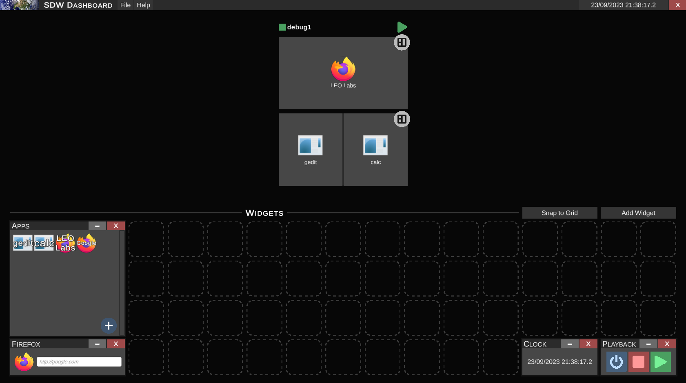

<!-- Improved compatibility of back to top link: See: https://github.com/othneildrew/Best-README-Template/pull/73 -->

<!-- PROJECT LOGO -->

  <h3 align="center">SDW Controller</h3>

  

    Dashboard app for the Swinburne Discovery Wall
     
    <a href="https://github.com/othneildrew/Best-README-Template"><strong>Explore the docs »</strong></a>
     
  

<!-- TABLE OF CONTENTS -->

  
Table of Contents

  <ol>
    <li>
      <a href="#about">About</a>
      <ul>
        <li><a href="#built-with">Built With</a></li>
        <li><a href="#supported-platforms">Supported Platforms</a></li>
      </ul>
    </li>
    <li><a href="#features">Features</a></li>
    <li><a href="#usage">Usage</a></li>
    <li>
      <a href="#contributing">Contributing</a>
      <ul>
        <li><a href="#prerequisites">Prerequisites</a></li>
        <li><a href="#installation">Installation</a></li>
      </ul>
    </li>
    <li><a href="#acknowledgments">Acknowledgments</a></li>
  </ol>

<!-- ABOUT -->
## About

The SDW Controller is a dashboard app which, in combination with the SDW Listener, allows users of the SSA Lab to remotely launch applications for all KeckDisplays from a single KeckDisplay.

#### Built With
![Unity][unity] ![CSharp][cs]

#### Supported Platforms
![CentOS][centos]

(<a href="#readme-top">back to top</a>)

<!-- FEATURES -->
## Features

- [x] TCP communication
- [ ] SSH functionality
- [x] Dialog/popup system
    - [x] File Picker
    - [x] Confirm
- [x] Widget system
    - [x] Play/Stop All
    - [x] Clock
    - [x] Apps
    - [x] Firefox
    - [ ] Console
    - [ ] `Data Streams` integration
- [x] SDW system
    - [x] Layout selection
    - [x] App selection
    - [x] App execution
- [ ] Logging
- [ ] Save/Load
    - [x] SDW
    - [ ] Widgets

(<a href="#readme-top">back to top</a>)

<!-- USAGE -->
## Usage

Provide instructions on how to download the latest release, install/extract it, run it, etc.

(<a href="#readme-top">back to top</a>)

<!-- CONTRIBUTING -->
## Contributing

This is an example of how you may give instructions on setting up the project locally and start contributing.

### Prerequisites

### Installation

(<a href="#readme-top">back to top</a>)

<!-- ACKNOWLEDGMENTS -->
## Acknowledgments

* [Img Shields](https://shields.io)

(<a href="#readme-top">back to top</a>)

<!-- MARKDOWN LINKS & IMAGES -->
<!-- https://www.markdownguide.org/basic-syntax/#reference-style-links -->
[centos]: https://img.shields.io/badge/Cent%20OS-262577?style=for-the-badge&logo=CentOS&logoColor=white
[windows]: https://img.shields.io/badge/Windows-0078D6?style=for-the-badge&logo=windows&logoColor=white
[mac]: https://img.shields.io/badge/mac%20os-000000?style=for-the-badge&logo=apple&logoColor=white
[unity]: https://img.shields.io/badge/Unity-100000?style=for-the-badge&logo=unity&logoColor=white
[cs]: https://img.shields.io/badge/C%23-239120?style=for-the-badge&logo=c-sharp&logoColor=white
